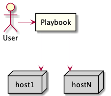

# Alfresco Ansible Deployment

This project provides an [Ansible](https://www.ansible.com) playbook capable of
deploying Alfresco Content Services (ACS).

Ansible is an open-source software provisioning, configuration management and
application-deployment tool enabling infrastructure as code.

A user runs a playbook that deploys to any number of hosts as shown in the
diagram below.

## Prerequisites

* If you want to install the Enterprise version, Nexus credentials for [https://artifacts.alfresco.com](https://artifacts.alfresco.com)

## Documentation

Please refer to the [Documentation](./docs/README.md) for an overview of the
project and the playbook or go directly to the
[deployment guide](./docs/deployment-guide.md) to learn how to run the playbook.

Users upgrading from previous versions of the playbook may want to take a look
to [Upgrade Notes](docs/playbook-upgrade.md).

## Development

Developer's guide is available [here](docs/developer-guide.md).

## License

The code in this repository is released under the Apache License, see the
[LICENSE](./LICENSE) file for details.

## Contribution

Please use [this guide](CONTRIBUTING.md) to make a contribution to the project
and information to report any issues.

## Release

See the [dedicated section in developer guide](docs/developer-guide.md#release).

Update [adding support for a new distribution](docs/developer-guide.md#adding-support-for-a-new-distribution).
