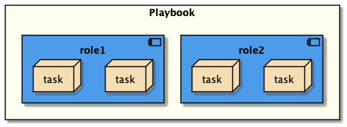

# Documentation

This page provides an overview of Ansible, the project structure and the components deployed.

## Ansible Overview

[Ansible](https://www.ansible.com/overview/how-ansible-works) models your IT infrastructure by describing how all of your systems inter-relate, rather than just managing one system at a time.

It doesn't use any agents nor additional custom security infrastructure, so it's easy to deploy - and most importantly, it uses a very simple language, YAML, in the form of Ansible Playbooks that allow you to describe your automation jobs in a way that approaches plain English.

An Ansible playbook contains one or more roles. A role is an independent component which allows reuse of common configuration steps. It consists of a set of tasks used to configure a host to serve a certain purpose, for example, configuring a service. This is depicted in the diagram below.

Roles are defined using YAML files with a predefined directory structure.

A role directory structure contains directories: defaults, vars, tasks, files, templates, meta, and handlers.

* **defaults** contains default variables for the role. Variables in defaults have the lowest priority so they are easy to override
* **vars** contains variables for the role. Variables in vars have higher priority than variables in the defaults directory
* **tasks** contains the main list of steps to be executed by the role
* **files** contains files which we want to be copied to the remote host. We don’t need to specify a path of resources stored in this directory
* **templates** contains file templates which support modifications from the role. We use the Jinja2 templating language for creating templates
* **meta** contains metadata of the role like an author, support platforms, and dependencies
* **handlers** contains handlers which can be invoked by “notify” directives and are associated with a service

## Project Overview

The project contains a playbook and multiple roles.

The ACS playbook can be found in the _playbooks_ directory. Because the project makes use of Ansible role structure, the playbook contains only definitions of the roles, and all the logic is performed by them, thus making the project both granular and easy to maintain.

The playbook uses the following roles:

* **acc** - deploys and configures Alfresco Control Center
* **activemq** - deploys and configures Apache ActiveMQ
* **adw** - deploys and configures Alfresco Digital Workspace
* **common** - contains a set of common tasks that prepares the specified host for other roles (creates user and group, common directories)
* **elasticsearch** - deploys and configures ElasticSearch cluster required by Alfresco Search Enterprise
* **java** - deploys OpenJDK
* **nginx** - deploys and configures Nginx as a proxy
* **postgres** - deploys and configures PostgreSQL
* **repository** - deploys and configures Alfresco Repository and Alfresco Share
* **search** - deploys and configures Alfresco Search Services
* **search_enteprise** - deploys and configures Alfresco Search Enterprise
* **sfs** - deploys and configures Alfresco Shared File Store
* **sync** - deploys and configures Alfresco Sync Service
* **tomcat** - deploys and configures Apache Tomcat
* **transformers** - deploys and configures Alfresco Transform Service
* **trouter** - deploys and configures the Transform Router

The same playbook can be run to deploy the system in several different ways, please refer to the [deployment guide](./deployment-guide.md) for a step by step set of instructions.

## Versioning

While ACS supports a wide range of OS, the playbook is only known to work and is
supported for a subset of them. The table below gives detailed information on
the status of supported OS.

Legend:

* :white_check_mark: platform supported and tested on this playbook
* :ballot_box_with_check: platform supported but not automatically tested on this playbook
* :x: platform not supported by this playbook (despite officially supported by Alfresco)
* `-` platform not officially supported by Alfresco

| OS Flavor / version | 7.4 Enterprise/Community | 7.3 Enterprise     | 7.2 Enterprise     | 7.1 Enterprise     | 7.0 Enterprise     |
|---------------------|--------------------------|--------------------|--------------------|--------------------|--------------------|
| Amazon Linux (v2)   | :x:                      | :x:                | :x:                | :x:                | :x:                |
| Amazon Linux (v1)   | :x:                      | :x:                | :x:                | :x:                | :x:                |
| RHEL 8.7            | :ballot_box_with_check:  | -                  | -                  | -                  | -                  |
| RHEL 8.6            | :white_check_mark:       | :white_check_mark: | -                  | -                  | -                  |
| RHEL 8.5            | :ballot_box_with_check:  | :white_check_mark: | :white_check_mark: | -                  | -                  |
| RHEL 8.4            | -                        | :white_check_mark: | :white_check_mark: | :white_check_mark: | :white_check_mark: |
| RHEL 8.2            | -                        | :white_check_mark: | :white_check_mark: | :white_check_mark: | :white_check_mark: |
| RHEL 7.7            | -                        | -                  | -                  | :white_check_mark: | :white_check_mark: |
| RHEL 7.6            | -                        | -                  | -                  | :white_check_mark: | :white_check_mark: |
| CentOS 7 x64        | :ballot_box_with_check:  | :white_check_mark: | :white_check_mark: | :white_check_mark: | :white_check_mark: |
| Ubuntu 22.04        | :white_check_mark:       | :white_check_mark: | -                  | -                  | -                  |
| Ubuntu 20.04        | :white_check_mark:       | :white_check_mark: | :white_check_mark: | :white_check_mark: | :white_check_mark: |
| Ubuntu 18.04        | -                        | -                  | :white_check_mark: | :white_check_mark: | :white_check_mark: |
| SUSE 15.0           | -                        | -                  | -                  | -                  | :x:                |
| SUSE 12.0 SP1 x64   | -                        | -                  | -                  | -                  | :x:                |

> Ansible version used for testing this playbook can be retrieved [here](https://github.com/Alfresco/alfresco-ansible-deployment/blob/master/Pipfile#L7).

The table below shows the version of the components deployed by the playbook for ACS 7.x.

| Component           | 7.4 Enterprise | 7.3 Enterprise | 7.2 Enterprise | 7.1 Enterprise | 7.0 Enterprise | 7.4 Community |
|---------------------|----------------|----------------|----------------|----------------|----------------|---------------|
| OpenJDK             | 17.0.3         | 17.0.3         | 11.0.15        | 11.0.15        | 11.0.15        | 17.0.3        |
| Apache Tomcat       | 9.0.59         | 9.0.59         | 9.0.59         | 9.0.59         | 8.5.76         | 9.0.59        |
| PostgreSQL          | 14.x           | 14.x           | 13.x           | 13.x           | 13.x           | 14.x          |
| Apache ActiveMQ     | 5.16.6         | 5.16.6         | 5.16.6         | 5.16.6         | 5.16.6         | 5.16.6        |
| Repository          | 7.4.0          | 7.3.0          | 7.2.1          | 7.1.1          | 7.0.1.4        | 7.4.0         |
| Share               | 7.4.0          | 7.3.0          | 7.2.1          | 7.1.1          | 7.0.1.4        | 7.4.0         |
| Search Services     | 2.0.6.1        | 2.0.5          | 2.0.4          | 2.0.2          | 2.0.1.1        | 2.0.6.1       |
| Search Enterprise   | 3.3.0          | 3.2.0          | 3.1.1          | 3.1.1          | -              | N/A           |
| All-In-One T-Engine | 3.1.0          | 3.0.0          | 2.5.7          | 2.5.6          | 2.3.10         | 3.1.0         |
| AOS                 | 1.6.0          | 1.5.0          | 1.4.1          | 1.4.0          | 1.4.0          | 1.6.0         |
| Google Docs         | 3.4.0          | 3.3.0          | 3.2.2          | 3.2.1          | 3.2.1          | 3.4.0         |
| Digital Workspace   | 4.0.0          | 3.1.0          | 2.9.0          | 2.6.0          | 2.1.0          | N/A           |
| Transform Router    | 2.1.0          | 2.0.0          | 1.5.3          | 1.5.1          | 1.3.2          | N/A           |
| Shared File Store   | 2.1.0          | 2.0.0          | 0.16.1         | 0.16.1         | 0.13.0         | N/A           |
| Sync Service        | 3.9.0          | 3.8.0          | 3.6.0          | 3.5.0          | 3.4.0          | N/A           |

> Support for ACS 6.2 has been deprecated since November 2022, but you can still use the latest playbook that supported it ([v2.2.0](https://github.com/Alfresco/alfresco-ansible-deployment/releases/tag/v2.2.0))
