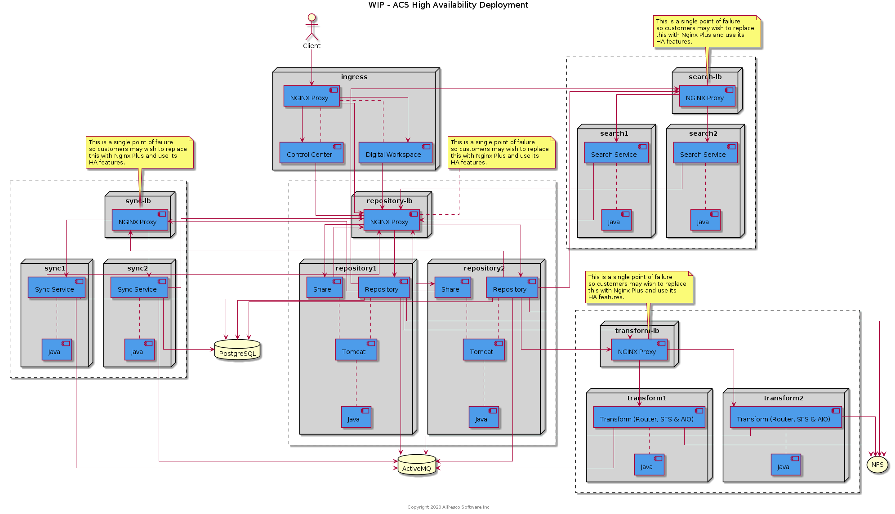

# Documentation

The diagram below shows how the ACS playbook uses the roles when deploying onto a single machine.

The diagram below shows how the ACS playbook uses the roles when the deployment is spread across multiple machines.

The diagram below shows how the high availabilty ACS playbook uses the roles to provide an HA deployment across multiple machines.

