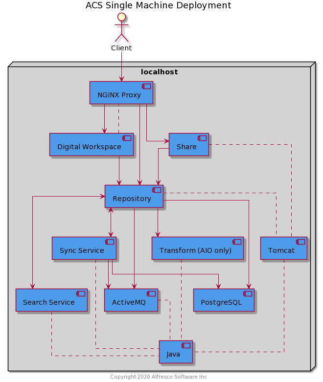

# Deployment Guide

This page describes how to deploy Alfresco Content Services (ACS) 6.2.x using Ansible.

The system deployed is shown in the diagram below.



## Prerequisites

* A CentOS 7 machine to deploy to, can be:
  * Bare Metal
  * Virtual Machine
  * EC2 instance (t3.large using ami-0affd4508a5d2481b in us-east-1)
* User running the playbook must have the ability to `sudo`
* SELinux is disabled

  This can be achieved by running the following command:

  ```bash
  sudo setenforce 0;
  ```

## Deploy

1. Install Git

    ```bash
    sudo yum install -y git
    ```

2. Install Ansible

    ```bash
    sudo yum install -y https://dl.fedoraproject.org/pub/epel/epel-release-latest-7.noarch.rpm
    sudo yum install -y ansible
    ```

3. Clone the repository to the machine you wish to deploy to and switch to the stable tag:

    ```bash
    git clone https://github.com/Alfresco/alfresco-ansible-deployment.git
    cd alfresco-ansible-deployment
    git checkout tags/v1.0-A2
    ```

    > NOTE: As we protect the `Alfresco` organization with SAML SSO you will first have to authorize your SSH key or personal access token via [GitHub](https://github.com).

4. Create environment variables to hold your Nexus credentials as shown below (replacing the values appropriately):

    ```bash
    export NEXUS_USERNAME="<your-username>"
    export NEXUS_PASSWORD="<your-password>"
    ```

5. Execute the playbook as the current user using the following command (the playbook will escalate privileges when required):  

  5.1. To run the playbook on the local machine execute the following command  

  ```bash
    ansible-playbook playbooks/acs.yml -i inventory_local.yml
  ```

  5.2. To run the playbook on a remote host, the inventory file (inventory_remote.yml) needs to contain the IP of the host and the path to the ssh key used to connect the control machine to the host machine. You can specify one targetIP for all the hosts to obtain a single-machine deployment, or different targetIP's for a multi-machine deployment.

  A small example of how a host block should look:

```
activemq:
hosts:
  activemq_1:
    ansible_host: targetIP
    ansible_private_key_file: "/path/ssh_key.pem"
    ansible_ssh_common_args: -o UserKnownHostsFile=/dev/null -o ControlMaster=auto
      -o ControlPersist=60s -o ForwardX11=no -o LogLevel=ERROR -o IdentitiesOnly=yes
      -o StrictHostKeyChecking=no
    ansible_user: centos
    connection: ssh
```
   After editing the inventory file execute the following command

```bash
    ansible-playbook playbooks/acs.yml -i inventory_remote.yml
```

    > NOTE: The playbook takes around 30 minutes to complete.

Ansible will display play recap to let you know that everything is done, similar to the block bellow

```bash
PLAY RECAP *****************************************************************************************************************************************************************************************************************************************************************************************************************
activemq_1                 : ok=24   changed=0    unreachable=0    failed=0    skipped=17   rescued=0    ignored=0
adw_1                      : ok=24   changed=6    unreachable=0    failed=0    skipped=6    rescued=0    ignored=0
database_1                 : ok=20   changed=0    unreachable=0    failed=0    skipped=11   rescued=0    ignored=0
nginx_1                    : ok=21   changed=8    unreachable=0    failed=0    skipped=8    rescued=0    ignored=0
repository_1               : ok=92   changed=43   unreachable=0    failed=0    skipped=14   rescued=0    ignored=0
search_1                   : ok=34   changed=13   unreachable=0    failed=0    skipped=11   rescued=0    ignored=0
syncservice_1              : ok=39   changed=18   unreachable=0    failed=0    skipped=13   rescued=0    ignored=0
transformers_1             : ok=81   changed=10   unreachable=0    failed=0    skipped=44   rescued=0    ignored=0
```

6. Access the system using the following URLs using a browser on the same machine:

    * Digital Workspace: ```/workspace```
    * Share: ```/share```
    * Repository: ```/alfresco```

## Folder structure

You will find the Alfresco specific files in the following locations:
| Path   | Purpose   |
| ------ | --------- |
| ```/opt/alfresco```     | Binaries |
| ```/etc/opt/alfresco``` | Configuration |
| ```/var/opt/alfresco``` | Data |
| ```/var/log/alfresco``` | Logs |

## Known Issues

* The playbook is failing on CentOS 8
* The playbook downloads several large files so you will experience some pauses while they transfer and you'll also see the message "FAILED - RETRYING: Check on war download async task (nnn retries left)." appearing many times as the WAR file downloads
* The Tomcat access log is enabled by default and will grow in size quite quickly
* The playbook is not fully idempotent so may cause issues if you make changes and run many times

## Troubleshooting

The best place to start if something is not working are the log files, these can be found in the following locations:

* Nginx
  * `/var/log/alfresco/nginx.alfresco.error.log`
* Repository
  * `/var/log/alfresco/alfresco.log`
  * `/var/log/alfresco/catalina.out`
* Share
  * `/var/log/alfresco/share.log`
