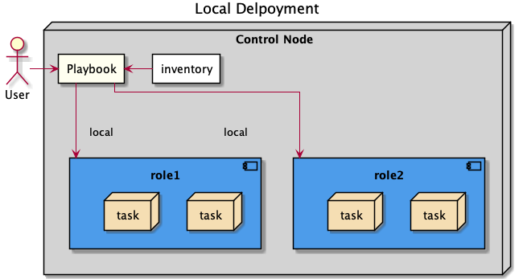
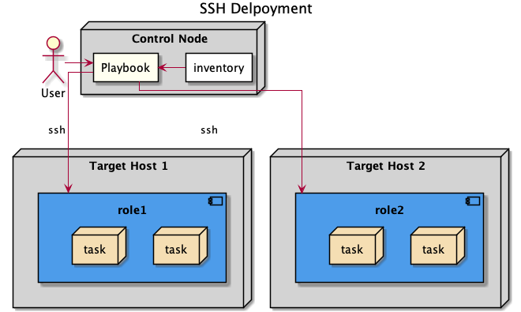
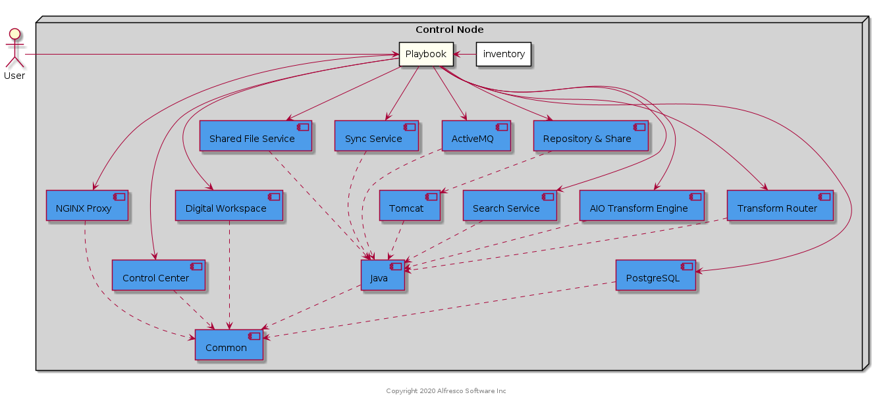
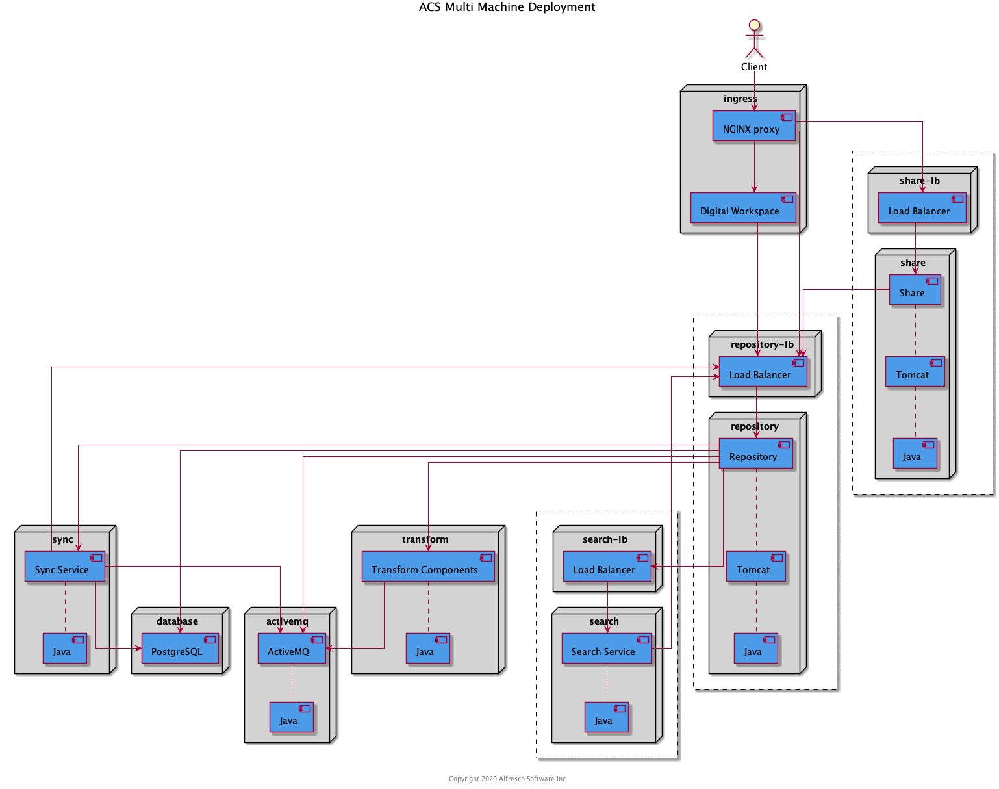

# Deployment Guide

This page describes how to deploy Alfresco Content Services (ACS) using the Ansible playbook found in this project.

Before continuing we need to introduce some more [Ansible concepts](https://docs.ansible.com/ansible/latest/user_guide/basic_concepts.html) and the notion of [idempotency](https://docs.ansible.com/ansible/latest/reference_appendices/glossary.html#term-Idempotency).

## The control node

The machine the playbook is run from is known as the control node. Ansible has some prerequisites for this control node. The main one is that it needs to run on a POSIX compliant system, meaning Linux or others Unix (including MacOSX) but not Windows.
On windows please make see the provided `Vagrantfile` in order to kick start a local Linux VM where to deploy the playbook.

More info on [control node](https://docs.ansible.com/ansible/latest/user_guide/basic_concepts.html#control-node)

## Understanding the inventory file

An inventory file is used to describe the architecture or environment where you want to deploy the ACS platform. Each machine taking part in the environment needs to be described with at least:

* an `inventory_name`: a name which, in most cases can be anything (It is though a good practice to use a name or address which all target machines can resolve and reach from their local network).

And optionally:

* an `ansible_user` variable: if the host requires a unique and specific user to login to.
* an `ansible_host` variable; if the host needs to be reached through an address that's different from the `inventory_hostname` (e.g. machine is only reachable through a bastion host or some sort of NAT).
* an `ansible_private_key_file` in case your hosts needs a specific SSH key in order to login to it.

An ACS inventory file has the following groups a host can belong to:

* `repository`: the list of one or more hosts which will get an Alfresco repo deployed on (see [the deployment guide](#acs-cluster) for details on repository clustering).

* `database`: a host on which the playbook will deploy PostgreSQL. See  [the deployment guide](./deployment-guide.md) for details on how to use another external RDBMS.
* `activemq`: the host on which the playbook will deploy the message queue component required by ACS.
* `external_activemq`: an alternative group to `activemq` in case you don't want to deploy ActiveMQ using our basic activemq role but instead use an ActiveMQ instance of yours which matched your hosting standards.
* `search`: a single host on which to deploy Alfresco Search services.
* `nginx`: a single host on which the playbook will deploy an NGINX reverse proxy configured for the numerous http based service in the platform.
* `adw`: a single host where you want the Alfresco Digital Workspace UI to be installed
* `transformers`: a single host where the playbook will deploy the Alfresco Transformation Services components
* `syncservice`: a single host where the Alfresco Device Sync service will be deployed

> Ansible also ships a default group called `all` which all hosts always belongs to

Inventory files provided as example in this playbook are all YAML written. Groups are always children items of the `all` group it self or of other groups. Hosts are mentioned after a `hosts` key under any group (including the `all` group).
So a generic example would be:

```yaml
---
all:
  children:
    group_name1:
      hosts:
        inventory_nameA:
```

An inventory file can also be used to set variable within a specific scope. Variables can be specified at the host, groups or all levels, thus affecting the scope in which that variable is available.
So if one variable (like `ansible_user` for example) is valid for all hosts, you'd better set it once under the `all` group.

See [Ansible variable precedence documentation](https://docs.ansible.com/ansible/latest/user_guide/playbooks_variables.html#understanding-variable-precedence) to better understand how precedence works.

In most cases we recommend you use your inventory to place the configuration variables you may need to tweak the playbook to your needs.

In this project you'll find 3 example inventory files:

The `inventory_local.yml` which is ready to use in order to deploy all components on the local machine.



The `inventory_ssh.yml` which provides s skeleton for you to update and match your architecture so each component can be deployed on a dedicated node.



The `inventory_ha.yml` which is very similar to the previous one but also provides s skeleton for repository clustering (see [the deployment guide](./deployment-guide.md) for details on repository clustering).

A complete documentation about inventory file is available at [inventory file](https://docs.ansible.com/ansible/latest/user_guide/intro_inventory.html#intro-inventory)

## Folder Structure

Regardless of role and connection type, a consistent folder structure is used. You will find the deployed files in the following locations:

| Path | Purpose |
| :--- | :--- |
| ```/opt/alfresco```     | Binaries |
| ```/etc/opt/alfresco``` | Configuration |
| ```/var/opt/alfresco``` | Data |
| ```/var/log/alfresco``` | Logs |

## Service Configuration

The following systemd services are deployed and can be used to stop and start Alfresco components:

| Service Name | Purpose |
| :--- | :--- |
| ```activemq.service``` | ActiveMQ Service |
| ```postgresql-<version>.service``` | Postgresql DB Service (where `<version>` is 11 for ACS 6.2.N and 13 for ACS 7.x) |
| ```nginx.service``` | Nginx Service |
| ```alfresco-content.service``` | Alfresco Content Service |
| ```alfresco-search.service``` | Alfresco Search Service |
| ```alfresco-shared-fs.service``` | Alfresco Shared File Store Controller Service |
| ```alfresco-sync.service``` | Alfresco Sync Service |
| ```alfresco-tengine-aio.service``` | Alfresco AIO Transform Core Engine |
| ```alfresco-transform-router.service``` | Alfresco Transformation Router Service |

Please be aware that some configuration changes (e.g. postgres pg_hba,
properties files, ...) can trigger a service restart and a consequent
application downtime. For this reason you may want to run the playbook only
during a scheduled maintenance window.

## TCP Port Configuration

Several roles setup services that listen on TCP ports and several roles wait for TCP ports to be listening before continuing execution (indicated by `Yes` in the "Required For Deployment" column). The table below shows the communication paths and port numbers used.

| Target Host | Target Port | Source Hosts | Required For Deployment |
| :--- | :--- | :--- | :--- |
| activemq | 61616 | repository, syncservice, transformers | Yes |
| database | 5432 | repository, syncservice | Yes |
| repository | 8080 | nginx, search, syncservice | Yes |
| search | 8983 | repository | No |
| transformers (aio t-engine) | 8090 | repository | No |
| syncservice | 9090 | nginx | No |
| adw | 80 | nginx | No |
| nginx | 80 | `<client-ips>` | No |
| nginx | 443 | `<client-ips>` | No |

> NOTE: The transformers host will also contain the transform router process running on port 8095 and the shared file system process running on 8099 but communication between these components remains local.

## Getting Started Quickly

The quickest way to get started and experiment with the playbook is by leveraging Vagrant to create a Virtualbox virtual machine to act as the control node **and** the target host.

1. Ensure your local machine has a minimum of 10G of memory and 4 CPUs
2. Clone this repository to your local machine
3. Install [Vagrant](https://www.vagrantup.com/downloads)
4. Install [Virtualbox](https://www.virtualbox.org/wiki/Downloads)
5. Open Virtualbox application
6. In a terminal, navigate to the where you cloned the repository
7. Create environment variables to hold your Nexus credentials as shown below (replacing the values appropriately):

    ```bash
    export NEXUS_USERNAME="<your-username>"
    export NEXUS_PASSWORD="<your-password>"
    ```

8. Run the following command:
  
    ```bash
    vagrant up
    ```

    > NOTE: The playbook takes around 30 minutes to complete.

Once ACS has initialized access the system using the following URLs using a browser:

* Digital Workspace: `http://192.168.56.100/workspace`
* Share: `http://192.168.56.100/share`
* Repository: `http://192.168.56.100/alfresco`
* API Explorer: `http://192.168.56.100/api-explorer`

To access the machine vagrant created and ran the playbook on use `vagrant ssh`.

## Setup A Control Node

As mentioned in the introduction a control node is required to run the playbook.
**Required Ansible version is 2.12.**

Not all distributions of Linux may have that specific version of Ansible. Below describes how to configure a control node for deployment with one of the many ways to set a python virtual environment, so you can install the exact same versions of ansible and its dependencies we use when testing (without impacting your system installation of python). Doing so you're ensuring best chances of success.

1. If you're not working directly working on the control node, transfer the ZIP file to the control node together with the SSH private key required to login to the target machines, and SSH into the machine:

    ```bash
    scp  alfresco-ansible-deployment-<version>.zip user@controlnode:
    scp  ~/.ssh/ansible_rsa user@controlnode:.ssh
    ssh  user@controlnode
    ```

    > You may want to generate an SSH key pair locally and use it later for deployment. Wether you generate one or you use one you copied over to the control node, it is your responsibility to deploy it to the target machines so Ansible can use it.
    > Using SSH keys is recommended but not mandatory. If using password instead make sure to add the `-k`switch to the ansible command so it prompts you for a password.

2. Check prerequisites and install required tools:

    ```bash
    python --version # must be at least 3.8 in order to use Ansible 2.12
    sudo apt install virtualenvwrapper unzip # Use your distro's package manager instead of apt if it's not Debian based
    ```

3. Install Ansible and required dependencies in python virtualenv:

    ```bash
    unzip alfresco-ansible-deployment-<version>.zip
    cd alfresco-ansible-deployment
    mkvirtualenv alfresco-ansible
    pip install -r requirements.txt
    ansible-galaxy install -r requirements.yml
    ```

4. If you intend to deploy an Enterprise system, create environment variables to hold your Nexus credentials as shown below (replacing the values appropriately):

    ```bash
    export NEXUS_USERNAME="<your-username>"
    export NEXUS_PASSWORD="<your-password>"
    ```

Now you have the control node setup you can [configure](#configure-your-deployment) your deployment and decide what kind of deployment you would like.

To deploy everything on the control node follow the steps in the [Locahost Deployment](#localhost-deployment) section or to deploy to one or more other machines follow the steps in the [SSH Deployment](#ssh-deployment) section.

## Configure Your Deployment

By default, without any configuration applied, the playbook will deploy a limited trial of the Enterprise version of Alfresco Content Services 7.x that goes into read-only mode after 2 days. If you'd like to try Alfresco Content Services for a longer period, request the 30-day [Download Trial](https://www.alfresco.com/platform/content-services-ecm/trial/download).

The sections below describe how you can configure your deployment before running the playbook.

### License

If you have a valid license place your `.lic` file in the `configuration_files/licenses` folder before running the playbook.

> NOTE: You can also [upload a license](https://docs.alfresco.com/content-services/latest/admin/license/) via the Admin Console once the system is running.

### Alfresco/Solr authentication

As of ACS 7.2 and/or Search services 2.0.3, the repository <--> solr communication requires to be authenticated. The playbook will set up that authentication scheme using the new `secret` method.
This methods needs to be passed a shared secret. In order to do so use the variable below:

```yaml
reposearch_shared_secret: dummy
```

> Of course do not use dummy as shown above, but use a stronger secret

This secret should be placed either in the inventory file under the `all` group scope, or passed as an extra variable (it needs to be available to the localhost's hostvars array of variables)

:warning: Should you forget to provide that shared secret, the playbook will generate a random one. While that may sound convenient keep in mind that doing so will break the idempotency of the playbook and the shared secret will be updated every time you run the playbook.

### Alfresco Global Properties

You can provide your [repository configuration](https://github.com/Alfresco/acs-deployment/blob/master/docs/properties-reference.md) by editing the `configuration_files/alfresco-global.properties` file.

The properties defined in this file will be appended to the generated "alfresco-global.properties" located in "/etc/opt/alfresco/content-services/classpath".

### Enable SSL

If you have a FQDN and a certificate you want to use place the certificate and the key in the `configuration_files/ssl_certificates` folder before running the playbook. Also replace the `fqdn_alfresco: "your_domain.com"` with your own domain in `group_vars/all.yml` along with setting `use_ssl: true`.

> NOTE: The certificate and the key should be named the same as the domain eg: `your_domain.com.key` and `your_domain.com.crt`

### AMPs

Several AMP files are downloaded and applied during playbook execution, these are defined in a variable which is either in the `group_vars/all.yml` file or an extra-var file (in case of older ACS version).
For that reason there is common way to override that variable. If you want to change the list of AMPs you'll need to directly change the variable from the file where it is defined.

1. Open `group_vars/all.yml` or the `x.y.N-extra-vars.yml` file  and amend `amp_downloads` variable definition
2. In the `group_vars/all.yml` file, Add any additional AMP you want to apply to the `amp_downloads` variable as well, paying close attention to the `dest` property. If it's a repository AMP use the `amps_repo` folder, if it's a Share AMP use the `amps_share` folder
3. Save the file and run the playbook as normal.

> NOTE: This mechanism is sub-optimal and will be improved in a future release.

### JVM Options

Each Java based service deployed by the playbook is configured with some default settings, including memory settings.

The defaults are defined in the roles' specific default variables (see the [Ansible Overview paragraph in the README file](./README.md)) so they can be overridden in the inventory_file using the right scope.

For example, to override the JAVA_OPTS environment variable for the All-In-One Transform Engine place the following in inventory file:

```yaml
---
all:
  children:
    transformers:
      tengine_environment:
        JAVA_OPTS:
          - -Xms512m
          - -Xmx1g
          - $JAVA_OPTS
```

All the `_environment` variables defined in roles are dictionaries, and all their keys are added to the relevant components start script thus allowing you to define any number of environment variables. Key values are a list of strings to allow for easier manipulation.
When overriding the default env vars you should make sure you're not retiring important ones so always take a look at the ``roles/ROLE_NAME/defaults/main.yml` file first.

### External Databases

By default the playbook will deploy and configure a Postgres server for you. That server is a basic PostgreSQL setup with no specific optimization or features. For example, it doesn't provide any high availability mechanism.

> This server also requires to NOT have a sudo configuration with `requirestty` set.

If you'd prefer to use an external database server you can override the `repo_db_url` variable.

An example custom database url is shown below:

```yaml
repo_db_url: jdbc:mysql://54.164.117.56:3306/alfresco?useUnicode=yes&characterEncoding=UTF-8
repo_db_driver: com.mysql.jdbc.Driver
```

Along with the url the database driver binaries need to be provided for one or both services in the `configuration_files/db_connector_repo` and/or `configuration_files/db_connector_sync` folders.

The default database username (`repo_db_username` and/or `sync_db_username`) and password (`repo_db_password` and/or `sync_db_password`) in the configuration file `group_vars/all.yml` can also be overridden with your custom values.

Please refer to the [Configuring Databases](https://docs.alfresco.com/content-services/latest/config/databases/) documentation for more detailed information.

### External ActiveMQ

This playbook provides support for a single host declared inside the `activemq`
group that will deploy and configure an ActiveMQ instance that is suitable for
testing/evaluation only (no failover and default credentials).

It's strongly suggested that you provide your own ActiveMQ instance by defining
in the inventory file, exactly one host as a member of the `external_activemq` group
(nested inside the `external` group) as follows:

```yaml
all:
  children:
    external_activemq:
      hosts:
        whatever.mq.eu-west-1.amazonaws.com:
          activemq_username: alfresco
          activemq_password: alfresco
          activemq_port: 61617
    external:
      children:
        external_activemq:
```

Every hosts under the `external` group is not directly managed by the acs
playbook and is required in the inventory just for the sake of architecture description.

### Custom Keystore

By default the playbook deploys a default keystore to ease the installation process, however, we recommend you [generate your own keystore](https://docs.alfresco.com/content-services/latest/admin/security/#managealfkeystores) following the [instructions here](https://docs.alfresco.com/content-services/latest/admin/security/#keystore-configuration).

There are three steps required to use a custom keystore:

1. Place your generated keystore file in the `configuration_files/keystores` folder (these get copied to /var/opt/alfresco/content-services/keystore)
2. Override the `use_custom_keystores` variable defined in your inventory as a `repository` group variable.
3. Override the `acs_environment` variable and define your custom JAVA_TOOL_OPTIONS configuration

An example snippet of inventory file is shown below:

```yaml
repository:
  vars:
    use_custom_keystores: true
    acs_environment:
      JAVA_OPTS: 
        - -Xms512m
        - -Xmx3g
        - -XX:+DisableExplicitGC
        - -XX:+UseConcMarkSweepGC
        - -Djava.awt.headless=true
        - -XX:ReservedCodeCacheSize=128m
        - $JAVA_OPTS"
      JAVA_TOOL_OPTIONS: 
        - -Dencryption.keystore.type=pkcs12
        - -Dencryption.cipherAlgorithm=AES/CBC/PKCS5Padding
        - -Dencryption.keyAlgorithm=AES
        - -Dencryption.keystore.location=/var/opt/alfresco/content-services/keystore/<your-keystore-file>
        - -Dmetadata-keystore.password=<your-keystore-password>
        - -Dmetadata-keystore.aliases=metadata
        - -Dmetadata-keystore.metadata.password=<your-keystore-password>
        - -Dmetadata-keystore.metadata.algorithm=AES"
```

## Localhost Deployment

The diagram below shows the result of a localhost deployment.



To deploy ACS 7.1 Enterprise on the local machine navigate to the folder you extracted the ZIP to and execute the playbook as the current user using the following command (the playbook will escalate privileges when required):

```bash
ansible-playbook playbooks/acs.yml -i inventory_local.yml
```

Alternatively, to deploy an ACS Enterprise 7.0 system use the following command:

```bash
ansible-playbook playbooks/acs.yml -i inventory_local.yml -e "@7.0.N-extra-vars.yml"
```

Alternatively, to deploy an ACS Enterprise 6.2.N system use the following command:

```bash
ansible-playbook playbooks/acs.yml -i inventory_local.yml -e "@6.2.N-extra-vars.yml"
```

Or to deploy ACS Community use the following command:

```bash
ansible-playbook playbooks/acs.yml -i inventory_local.yml -e "@community-extra-vars.yml"
```

> NOTE: The playbook takes around 30 minutes to complete.

Once the playbook is complete Ansible will display a play recap to let you know that everything is done, similar to the block below:

```bash
PLAY RECAP *******************************************************************************************************
activemq_1                 : ok=24   changed=0    unreachable=0    failed=0    skipped=17   rescued=0    ignored=0
adw_1                      : ok=24   changed=6    unreachable=0    failed=0    skipped=6    rescued=0    ignored=0
database_1                 : ok=20   changed=0    unreachable=0    failed=0    skipped=11   rescued=0    ignored=0
nginx_1                    : ok=21   changed=8    unreachable=0    failed=0    skipped=8    rescued=0    ignored=0
repository_1               : ok=92   changed=43   unreachable=0    failed=0    skipped=14   rescued=0    ignored=0
search_1                   : ok=34   changed=13   unreachable=0    failed=0    skipped=11   rescued=0    ignored=0
syncservice_1              : ok=39   changed=18   unreachable=0    failed=0    skipped=13   rescued=0    ignored=0
transformers_1             : ok=81   changed=10   unreachable=0    failed=0    skipped=44   rescued=0    ignored=0
```

Once ACS has initialized access the system using the following URLs with a browser:

* Digital Workspace: `http://<control-node-public-ip>/workspace` (Enterprise Only)
* Share: `http://<control-node-public-ip>/share`
* Repository: `http://<control-node-public-ip>/alfresco`
* API Explorer: `http://<control-node-public-ip>/api-explorer`

## SSH Deployment

To deploy to hosts other than the control node an SSH connection is required. The control node must have network access to all the target hosts and permission to SSH into the machine.

The inventory file (`inventory_ssh.yml`) is used to specify the target IP addresses and the SSH connection details. You can specify one IP address for all the hosts to obtain a single-machine deployment, or different IP addresses for a multi-machine deployment.

The example snippet below demonstrates how to deploy the repository to a host with an IP address of `50.6.51.7` and SSH key at `/path/to/id_rsa`.

```yaml
repository:
  hosts:
    repository.acme.local:
      ansible_host: 50.6.51.7
      ansible_private_key_file: "/path/to/id_rsa"
```

If you want to deploy everything to a single machine follow the steps in the [Single Machine Deployment](#single-machine-deployment) section, alternatively, to deploy to any number of separate machines follow the steps in the [Multi Machine Deployment](#multi-machine-deployment) section.

### Single Machine Deployment

The diagram below shows the result of a single machine deployment.


> **NOTE**: You can optionally use the following [guide](./generate-target-hosts.md#generate-single-target-host) to generate a target host and an inventory file for testing purposes.

Once you have prepared the target host and configured the inventory_ssh.yaml file you are ready to run the playbook.

To check your inventory file is configured correctly and the control node is able to connect to the target host navigate to the folder you extracted the ZIP to and run the following command:

```bash
ansible all -m ping -i inventory_ssh.yml
```

To deploy ACS 7.1 Enterprise on the target host execute the playbook as the current user using the following command:

```bash
ansible-playbook playbooks/acs.yml -i inventory_ssh.yml
```

Alternatively, to deploy an ACS 7.0 Enterprise system use the following command:

```bash
ansible-playbook playbooks/acs.yml -i inventory_ssh.yml -e "@7.0.N-extra-vars.yml"
```

Alternatively, to deploy an ACS 6.2.N Enterprise system use the following command:

```bash
ansible-playbook playbooks/acs.yml -i inventory_ssh.yml -e "@6.2.N-extra-vars.yml"
```

Or to deploy ACS Community use the following command:

```bash
ansible-playbook playbooks/acs.yml -i inventory_ssh.yml -e "@community-extra-vars.yml"
```

> NOTE: The playbook takes around 30 minutes to complete.

Once the playbook is complete Ansible will display a play recap to let you know that everything is done, similar to the block below:

```bash  
PLAY RECAP *******************************************************************************************************
activemq_1                 : ok=24   changed=0    unreachable=0    failed=0    skipped=17   rescued=0    ignored=0
adw_1                      : ok=24   changed=6    unreachable=0    failed=0    skipped=6    rescued=0    ignored=0
database_1                 : ok=20   changed=0    unreachable=0    failed=0    skipped=11   rescued=0    ignored=0
nginx_1                    : ok=21   changed=8    unreachable=0    failed=0    skipped=8    rescued=0    ignored=0
repository_1               : ok=92   changed=43   unreachable=0    failed=0    skipped=14   rescued=0    ignored=0
search_1                   : ok=34   changed=13   unreachable=0    failed=0    skipped=11   rescued=0    ignored=0
syncservice_1              : ok=39   changed=18   unreachable=0    failed=0    skipped=13   rescued=0    ignored=0
transformers_1             : ok=81   changed=10   unreachable=0    failed=0    skipped=44   rescued=0    ignored=0
```

Once ACS has initialized access the system using the following URLs with a browser:

* Digital Workspace: `http://<target-host-ip>/workspace` (Enterprise Only)
* Share: `http://<target-host-ip>/share`
* Repository: `http://<target-host-ip>/alfresco`
* API Explorer: `http://<target-host-ip>/api-explorer`

### Multi Machine Deployment

The diagram below shows the result of a multi machine deployment.



> **NOTE**: You can optionally use the following [guide](./generate-target-hosts.md#generate-multiple-target-hosts) to generate target hosts and an inventory file for testing purposes.

Once you have prepared the target hosts (ensuring the [relevant ports](#tcp-port-configuration) are accessible) and configured the inventory_ssh.yaml file you are ready to run the playbook.

To check your inventory file is configured correctly and the control node is able to connect to the target hosts run the following command:

```bash
ansible all -m ping -i inventory_ssh.yml
```

**Optional** To check if the required ports for the deployment are available on the target machine and we also have connectivity between nodes (ex. repository connecting to the db on 5432) please run the prerequisite_checks playbook before you deploy ACS. If there are any firewalls blocking connectivity this playbook will discover them.

```bash
ansible-playbook playbooks/prerequisite_checks.yml -i inventory_ssh.yml
```

To deploy ACS 7 Enterprise on the target hosts execute the playbook as the current user using the following command:

```bash
ansible-playbook playbooks/acs.yml -i inventory_ssh.yml
```

Alternatively, to deploy an ACS 6.2.N Enterprise system use the following command:

```bash
ansible-playbook playbooks/acs.yml -i inventory_ssh.yml -e "@6.2.N-extra-vars.yml"
```

Or to deploy ACS Community use the following command:

```bash
ansible-playbook playbooks/acs.yml -i inventory_ssh.yml -e "@community-extra-vars.yml"
```

> NOTE: The playbook takes around 30 minutes to complete.

Once the playbook is complete Ansible will display a play recap to let you know that everything is done, similar to the block below:

```bash  
PLAY RECAP *******************************************************************************************************
activemq_1                 : ok=24   changed=0    unreachable=0    failed=0    skipped=17   rescued=0    ignored=0
adw_1                      : ok=24   changed=6    unreachable=0    failed=0    skipped=6    rescued=0    ignored=0
database_1                 : ok=20   changed=0    unreachable=0    failed=0    skipped=11   rescued=0    ignored=0
nginx_1                    : ok=21   changed=8    unreachable=0    failed=0    skipped=8    rescued=0    ignored=0
repository_1               : ok=92   changed=43   unreachable=0    failed=0    skipped=14   rescued=0    ignored=0
search_1                   : ok=34   changed=13   unreachable=0    failed=0    skipped=11   rescued=0    ignored=0
syncservice_1              : ok=39   changed=18   unreachable=0    failed=0    skipped=13   rescued=0    ignored=0
transformers_1             : ok=81   changed=10   unreachable=0    failed=0    skipped=44   rescued=0    ignored=0
```

Once ACS has initialized access the system using the following URLs with a browser:

* Digital Workspace: `http://<nginx-host-ip>/workspace` (Enterprise Only)
* Share: `http://<nginx-host-ip>/share`
* Repository: `http://<nginx-host-ip>/alfresco`
* API Explorer: `http://<nginx-host-ip>/api-explorer`

### Additional command switches for ansible-playbook

There are some useful argument you can use with `ansible-playbook` command in many circumstances. Some are highlighted bellow but take a look at [The ansible-playbook documentation](https://docs.ansible.com/ansible/latest/cli/ansible-playbook.html) for complete list of options.

* `-k` : Prompt for SSH password. Usefull when no SSH keys have been deployed but needs to be th same on all hosts (prefer SSH whenever possible)
* `-K` : Prompt for sudo password. Usefull when the user used to connect to the machine is not root
* `-e` : Pass an extra variable or override an existing one (read from file with `-e @file`).
* `-l` : Limit the play to a subset of hosts (either groups or individuals hosts or a mix of both)
* `-u user` : specify the username to use to cnnect to all targets (Prefer adding the ànsible_ssh_user` to the inventory file in the right scope, e.g. under the `all`group)

## ACS cluster

Due to load or high availability needs, you might want to deploy a cluster of several repository nodes. This can be achieved rather simply by:

* Giving the playbook the location of the shared storage used for the ACS contentstore (See [Shared storage documentation](shared-contentstore.md) for details).
* Specifying several hosts within the repository hosts group

> :warning: as mention in the [Alfresco official documentation](https://docs.alfresco.com/content-services/latest/admin/cluster/#scenarioredundancycluster), "All the servers in a cluster should have static IP addresses assigned to them".
> Not meeting this pre-requisite won't prevent the playbook from working but the cluster might will most likely stop working in case one of the server in the architecture changes IP address.

For example:

```yaml
...
    repository:
      vars:
        cs_storage:
          type: nfs
          device: nas.infra.local:/exports/contentstore
          options: _netdev,noatime,nodiratim
      hosts:
        ecm1.infra.local:
        ecm2.infra.local:
        ingester.infra.local:
          cluster_keepoff: true
...
```

In some circumstances, you may want to have a repo node that's dedicated to a scheduled task (such as ingesting massive amount of documents). Depending on the nature of the task and the requirements of your organisation, it may be preferable to not make this node part of the ACS cluster.
In that case, you can add the `cluster_keepoff` variable to one of the `repository` group nodes'. It will provision the node with the repository and share services but make sure it not taking part in neither the share, nor the repository cluster realm.

> A typical use case is to have a dedicated Solr tracking node. The playbook will then prefer to use that dedicated node - if it finds one - for solr tracking and only use the other as backup server (no load balancing)

## Cleanup

What needs to be removed from a system will depend on your inventory configuration. The steps below presume a localhost or single machine deployment i.e. where all roles were run on the same machine.

1. Stop and remove the following systemd services:
   * alfresco-transform-router.service
   * alfresco-shared-fs.service
   * alfresco-tengine-aio.service
   * alfresco-sync.service
   * alfresco-search.service
   * alfresco-content.service
   * nginx.service
   * activemq.service
   * postgresql-`version`.service (where `version` is 11 for ACS 6.2.N and 13 for ACS 7.x)
2. Remove the following yum packages:
   * ImageMagick
   * libreoffice
   * nginx
   * postgresql
3. Remove the following folders:
   * /opt/apache-activemq-`version`
   * /opt/apache-tomcat-`version`
   * /opt/libreoffice`version`
   * /opt/openjdk-`version`
   * /opt/alfresco
   * /etc/opt/alfresco
   * /var/opt/alfresco
   * /var/log/alfresco
   * /tmp/ansible_artefacts
   * /tmp/Alfresco

> NOTE: An additional "uninstall" playbook may be provided in the future.

## Known Issues

* The playbook downloads several large files so you will experience some pauses while they transfer and you'll also see the message "FAILED - RETRYING: Verifying if `<file>` finished downloading (nnn retries left)" appearing many times. Despite the wording this is **not** an error so please ignore and be patient!
* The playbook is not yet fully idempotent so may cause issues if you make changes and run multiple times
* The `firewalld` service can prevent the playbook from completing successfully if it's blocking the [ports required](#tcp-port-configuration) for communication between the roles
* The nginx and adw roles need to be deployed to the same host otherwise the [playbook fails](#nginx-failure)

## Troubleshooting

### Failed Downloads

If you see an error similar to the one below (in particular the mention of `HTTP Error 401: Unauthorized` or `HTTP Error 401: basic auth failed`) you've most likely forgotten to setup your Nexus credentials or mis-configured them.

```bash
fatal: [transformers_1]: FAILED! => {"msg": "An unhandled exception occurred while templating '{u'acs_zip_sha1_checksum': u\"{{ lookup('url', '{{ nexus_repository.enterprise_releases }}org/alfresco/alfresco-content-services-distribution/{{ acs.version }}/alfresco-content-services-distribution-{{ acs.version }}.zip.sha1', username=lookup('env', 'NEXUS_USERNAME'), password=lookup('env', 'NEXUS_PASSWORD')) }}\", u'adw_zip_sha1_checksum': u\"{{ lookup('url', '{{ nexus_repository.enterprise_releases }}/org/alfresco/alfresco-digital-workspace/{{ adw.version }}/alfresco-digital-workspace-{{ adw.version }}.zip.sha1', username=lookup('env', 'NEXUS_USERNAME'), password=lookup('env', 'NEXUS_PASSWORD')) }}\", u'acs_zip_url': u'{{ nexus_repository.enterprise_releases }}org/alfresco/alfresco-content-services-distribution/{{ acs.version }}/alfresco-content-services-distribution-{{ acs.version }}.zip'
...
...
Error was a <class 'ansible.errors.AnsibleError'>, original message: An unhandled exception occurred while running the lookup plugin 'url'. Error was a <class 'ansible.errors.AnsibleError'>, original message: Received HTTP error for https://artifacts.alfresco.com/nexus/service/local/repositories/enterprise-releases/content/org/alfresco/alfresco-content-services-distribution/7.0.0/alfresco-content-services-distribution-7.0.0.zip.sha1 : HTTP Error 401: Unauthorized"}
```

You can run the command shown below in the same terminal you're using to run the playbook to quickly test downloading a protected resource from Nexus.

```bash
wget -qO /dev/null --user=${NEXUS_USERNAME} --password=${NEXUS_PASSWORD} https://artifacts.alfresco.com/nexus/service/local/repositories/enterprise-releases/content/org/alfresco/alfresco-content-services-distribution/6.2.2/alfresco-content-services-distribution-6.2.2.pom
```

If everything is configured correctly you should see the following at the end of the output:

```bash
Saving to: ‘alfresco-content-services-distribution-6.2.2.pom’

alfresco-content-services-distribution-6.2.2.pom      100%[=============================================>]   8.53K  --.-KB/s    in 0.003s  

2021-02-18 13:50:44 (2.54 MB/s) - ‘alfresco-content-services-distribution-6.2.2.pom’ saved [8739/8739]
```

### Nginx Failure

If the playbook fails not being able to start Nginx, make sure both ADW and Nginx point to the same host in the inventory file. Otherwise you'll encounter the error below:

> TASK [../roles/adw : Ensure nginx service is running as configured.] *********
> fatal: [adw_1]: FAILED! => {"changed": false, "msg": "Unable to start service nginx: Job for nginx.service failed because the control process exited with error code.
> See "systemctl status nginx.service" and "journalctl -xe" for details.\n"}

### Communication Failures

If you are using a multi-machine deployment and the playbook fails with an error similar to the one shown below you may need to check the firewall configuration on the target hosts.

> TASK [../roles/repository : Notify alfresco content service] *****************
> fatal: [repository_1]: FAILED! => {"changed": false, "elapsed": 300, "msg": "Timeout when waiting for 192.168.0.126:5432"}

Either disable the firewall completely or refer to the [ports configuration](#tcp-port-configuration) section for what ports need to be accessible.

Presuming you are using `firewalld` the following example commands can be used to open a port, replacing `<port-number>` with the approriate number or replacing `<service-name>` with a well know service name e.g. "http".

```bash
firewall-cmd --permanent --add-port=<port-number>/tcp
```

or

```bash
firewall-cmd --permanent --add-service=<service-name>
```

> After the firewall config has been set up a reload of the `firewalld` service is needed

If you are using a host that is behind a proxy you might experience timeouts or `HTTP Error 401: Unauthorized` errors.

A possible quick fix is to make `http_proxy` and `https_proxy` available to either current user or to the entire system.

```bash
export http_proxy=<protocol><proxy_address>
export https_proxy=<protocol><proxy_address>
```

or add the values in the `/etc/environment`

```bash
echo http_proxy=<protocol><proxy_address> >> /etc/environment
echo https_proxy=<protocol><proxy_address> >> /etc/environment
```

If this does not solve the issue, check the proxy configuration or contact your system administrator

### Playbook Failures

If the playbook fails for some reason try re-running it with the `-v` option, if that still doesn't provide enough information try re-running with the `-vvv` option.

### Alfresco Failures

If the playbook completes successfully but the system is not functioning the best place to start is the log files, these can be found in the `/var/log/alfresco` folder on the target hosts. Please note the nginx log files are owned by root as the nginx process is running as root so it can listen on port 80.
