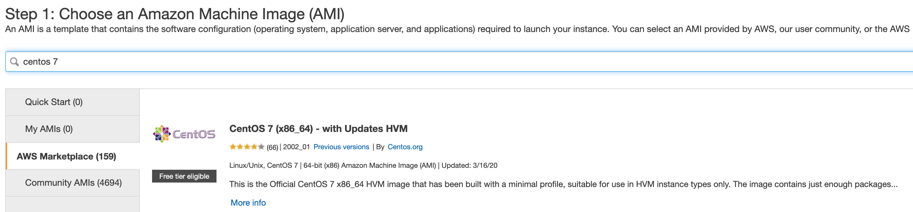

# Deployment Guide

This page describes how to deploy Alfresco Content Services (ACS) 6.2.x using the Ansible playbook found in this project.

Before continuing we need to introduce some more [Ansible concepts](https://docs.ansible.com/ansible/latest/user_guide/basic_concepts.html); [control node](https://docs.ansible.com/ansible/latest/user_guide/basic_concepts.html#control-node), [connection type](https://docs.ansible.com/ansible/latest/user_guide/intro_inventory.html#connecting-to-hosts-behavioral-inventory-parameters) and the [inventory file](https://docs.ansible.com/ansible/latest/user_guide/intro_inventory.html#intro-inventory).

The machine the playbook is run from is known as the control node. An inventory file is used to describe where the roles within the playbook should deploy to. There are two types of connection, `local` and `ssh`. Local means that everything will be installed on the control node, ssh means that everything will be deployed on one or more `hosts`, these hosts can be bare metal machines, Virtual machines or instances running on a public cloud. This is shown in the diagrams below:


## Folder Structure

Regardless of role and connection type a consistent folder structure is used, you will find the deployed files in the following locations:

| Path   | Purpose   |
| ------ | --------- |
| ```/opt/alfresco```     | Binaries |
| ```/etc/opt/alfresco``` | Configuration |
| ```/var/opt/alfresco``` | Data |
| ```/var/log/alfresco``` | Logs |

## Getting Started Quickly

The quickest way to get started and experiment with the playbook is by leveraging Vagrant to create a Virtualbox virtual machine to act as the control node **and** the target host.

1. Ensure your local machine has 10G of memory and 4 CPUs
2. Clone this repository to your local machine
3. Install [Vagrant](https://www.vagrantup.com/downloads)
4. Install [Virtualbox](https://www.virtualbox.org/wiki/Downloads)
5. Open Virtualbox application
6. In a terminal, navigate to the where you cloned the repository
7. Run the following command:
  
    ```bash
    vagrant up
    ```

    > NOTE: The playbook takes around 30 minutes to complete.

Once ACS has initialized access the system using the following URLs using a browser:

* Digital Workspace: [http://172.100.100.100/workspace](http://172.100.100.100/workspace)
* Share: [http://172.100.100.100/share](http://172.100.100.100/share)
* Repository: [http://172.100.100.100/alfresco](http://172.100.100.100/alfresco)
* API Explorer: [http://172.100.100.100/api-explorer](http://172.100.100.100/api-explorer)

## Setup A Control Node

As mentioned in the introduction a control node is required to run the playbook. You can use any computer that has a Python installation as a control node; laptops, shared desktops, and servers can all run Ansible.

In the interest of keeping this guide simple we will use an AWS EC2 instance as the control node, the steps required are shown below:

1. Launch an EC2 instance using the Centos 7 (x86_64) AMI from the Marketplace (instance size/type does not matter) and SSH into the machine

    

2. Install Ansible

    ```bash
    sudo yum install -y https://dl.fedoraproject.org/pub/epel/epel-release-latest-7.noarch.rpm
    sudo yum install -y ansible
    ```

3. Install Git

    ```bash
    sudo yum install -y git
    ```

4. Clone the repository and switch to the stable tag:

    ```bash
    git clone https://github.com/Alfresco/alfresco-ansible-deployment.git
    cd alfresco-ansible-deployment
    git checkout tags/v1.0-A3
    ```

    > NOTE: As we protect the `Alfresco` organization with SAML SSO you will first have to authorize your SSH key or personal access token via [GitHub](https://github.com).

5. Create environment variables to hold your Nexus credentials as shown below (replacing the values appropriately):

    ```bash
    export NEXUS_USERNAME="<your-username>"
    export NEXUS_PASSWORD="<your-password>"
    ```

Now you have the control node setup you need to decide what kind of deployment you would like. To deploy everything on the control node follow the steps in the [Locahost Deployment](#localhost-deployment) section or to deploy to one or more other machines follow the steps in the [SSH Deployment](#ssh-deployment) section.

## Localhost Deployment

The diagram below shows the result of a localhost deployment.


To deploy everything on the local machine just execute the playbook as the current user using the following command (the playbook will escalate privileges when required):

```bash
ansible-playbook playbooks/acs.yml -i inventory_local.yml
```

> NOTE: The playbook takes around 30 minutes to complete.

Once the playbook is complete Ansible will display a play recap to let you know that everything is done, similar to the block below:

```bash
PLAY RECAP *****************************************************************************************************************************************************************
activemq_1                 : ok=24   changed=0    unreachable=0    failed=0    skipped=17   rescued=0    ignored=0
adw_1                      : ok=24   changed=6    unreachable=0    failed=0    skipped=6    rescued=0    ignored=0
database_1                 : ok=20   changed=0    unreachable=0    failed=0    skipped=11   rescued=0    ignored=0
nginx_1                    : ok=21   changed=8    unreachable=0    failed=0    skipped=8    rescued=0    ignored=0
repository_1               : ok=92   changed=43   unreachable=0    failed=0    skipped=14   rescued=0    ignored=0
search_1                   : ok=34   changed=13   unreachable=0    failed=0    skipped=11   rescued=0    ignored=0
syncservice_1              : ok=39   changed=18   unreachable=0    failed=0    skipped=13   rescued=0    ignored=0
transformers_1             : ok=81   changed=10   unreachable=0    failed=0    skipped=44   rescued=0    ignored=0
```

Once ACS has initialized access the system using the following URLs with a browser:

* Digital Workspace: `http://<control-node-ip>/workspace`
* Share: `http://<control-node-ip>/share`
* Repository: `http://<control-node-ip>/alfresco`
* API Explorer: `http://<control-node-ip>/api-explorer`

## SSH Deployment

To deploy to hosts other than the control node an SSH connection is required. The control node must have network access to all the target hosts and permission to SSH into the machine.

The inventory file (`inventory_ssh.yml`) is used to specify the target IP addresses and the SSH connection details. You can specify one IP address for all the hosts to obtain a single-machine deployment, or different IP addresses for a multi-machine deployment.

If you want to deploy everything to a single machine follow the steps in the [Single Machine Deployment](#single-machine-deployment) section, to deploy everything to separate machines follow the steps in the [Multi Machine Deployment](#multi-machine-deployment) section.

### Single Machine Deployment

The diagram below shows the result of a single machine deployment.


> **NOTE**: You can optionally use the following [guide](./generate-target-hosts.md#generate-single-target-host) to generate a target host and an inventory file for testing purposes.

Once you have prepared the target host and configured the inventory_ssh.yaml file you are ready to run the playbook.

To check your inventory file is configured correctly and the control node is able to connect to the target host run the following command:

```bash
ansible all -m ping -i inventory_ssh.yml
```

To deploy everything on the target host execute the playbook as the current user using the following command:

```bash
ansible-playbook playbooks/acs.yml -i inventory_ssh.yml
```

> NOTE: The playbook takes around 30 minutes to complete.

Once the playbook is complete Ansible will display a play recap to let you know that everything is done, similar to the block below:

```bash  
PLAY RECAP *****************************************************************************************************************************************************************
activemq_1                 : ok=24   changed=0    unreachable=0    failed=0    skipped=17   rescued=0    ignored=0
adw_1                      : ok=24   changed=6    unreachable=0    failed=0    skipped=6    rescued=0    ignored=0
database_1                 : ok=20   changed=0    unreachable=0    failed=0    skipped=11   rescued=0    ignored=0
nginx_1                    : ok=21   changed=8    unreachable=0    failed=0    skipped=8    rescued=0    ignored=0
repository_1               : ok=92   changed=43   unreachable=0    failed=0    skipped=14   rescued=0    ignored=0
search_1                   : ok=34   changed=13   unreachable=0    failed=0    skipped=11   rescued=0    ignored=0
syncservice_1              : ok=39   changed=18   unreachable=0    failed=0    skipped=13   rescued=0    ignored=0
transformers_1             : ok=81   changed=10   unreachable=0    failed=0    skipped=44   rescued=0    ignored=0
```

Once ACS has initialized access the system using the following URLs with a browser:

* Digital Workspace: `http://<target-host-ip>/workspace`
* Share: `http://<target-host-ip>/share`
* Repository: `http://<target-host-ip>/alfresco`
* API Explorer: `http://<target-host-ip>/api-explorer`

### Multi Machine Deployment

The diagram below shows the result of a multi machine deployment.


> **NOTE**: You can optionally use the following [guide](./generate-target-hosts.md#generate-multiple-target-hosts) to generate target hosts and an inventory file for testing purposes.

Once you have prepared the target hosts and configured the inventory_ssh.yaml file you are ready to run the playbook.

To check your inventory file is configured correctly and the control node is able to connect to the target hosts run the following command:

```bash
ansible all -m ping -i inventory_ssh.yml
```

To deploy everything on the target hosts execute the playbook as the current user using the following command:

```bash
ansible-playbook playbooks/acs.yml -i inventory_ssh.yml
```

> NOTE: The playbook takes around 30 minutes to complete.

Once the playbook is complete Ansible will display a play recap to let you know that everything is done, similar to the block below:

```bash  
PLAY RECAP *****************************************************************************************************************************************************************
activemq_1                 : ok=24   changed=0    unreachable=0    failed=0    skipped=17   rescued=0    ignored=0
adw_1                      : ok=24   changed=6    unreachable=0    failed=0    skipped=6    rescued=0    ignored=0
database_1                 : ok=20   changed=0    unreachable=0    failed=0    skipped=11   rescued=0    ignored=0
nginx_1                    : ok=21   changed=8    unreachable=0    failed=0    skipped=8    rescued=0    ignored=0
repository_1               : ok=92   changed=43   unreachable=0    failed=0    skipped=14   rescued=0    ignored=0
search_1                   : ok=34   changed=13   unreachable=0    failed=0    skipped=11   rescued=0    ignored=0
syncservice_1              : ok=39   changed=18   unreachable=0    failed=0    skipped=13   rescued=0    ignored=0
transformers_1             : ok=81   changed=10   unreachable=0    failed=0    skipped=44   rescued=0    ignored=0
```

Once ACS has initialized access the system using the following URLs with a browser:

* Digital Workspace: `http://<webservers-host-ip>/workspace`
* Share: `http://<webservers-host-ip>/share`
* Repository: `http://<webservers-host-ip>/alfresco`
* API Explorer: `http://<webservers-host-ip>/api-explorer`

## Known Issues

* The playbook downloads several large files so you will experience some pauses while they transfer and you'll also see the message "FAILED - RETRYING: Verifying if `<file>` finished downloading (nnn retries left)" appearing many times. Despite the wording this is **not** an error so please ignore and be patient!
* The playbook is not yet fully idempotent so may cause issues if you make changes and run many times

## Troubleshooting

The best place to start if something is not working are the log files, these can be found in the following locations on the target hosts:

* Nginx
  * `/var/log/alfresco/nginx.alfresco.error.log`
* Repository
  * `/var/log/alfresco/alfresco.log`
  * `/var/log/alfresco/catalina.out`
* Share
  * `/var/log/alfresco/share.log`
