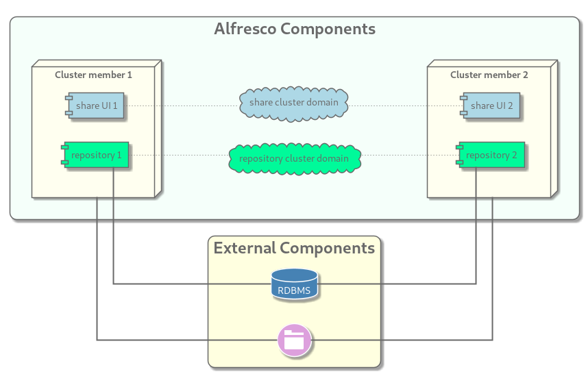

In enterprise environment, it's a common requirement to setup a platform so that data is stored on trusted device.

## Use cases

The contentstore is the location where you want Alfresco Content Service to write the data you store in its repository. Implementation may vary but by default files are stored there in a structured folder hierarchy as shown bellow:

```shell
contentstore.deleted
contentstore
└── 2022
    └── 2
        ├── 17
        │   └── 18
        │       ├── 54
        │       └── 55
        └── 18
            └── 2
                ├── 22
                ├── 23
                ├── 24
                └── 25
```

The most common use cases which involve setting up a dedicated, enterprise grade contentstore are listed bellow (non exhaustive list):

- You bought expensive storage hardware and want to leverage all the goodness that comes with it. For example, your NetApp NAS offers snapshots capabilities which will help you a lot improving your backup procedure.
- Your data is really critical and you want to leverage the storage architecture which offers cross-site replication.
- Your network topology involves a clear seperation between data and applications.
- Your workload cannot be handled by a single server and you need to setup a cluster.

## The approach to storage integration

While ACS only need to be given a filesystem, the underlying implementation and deployment methodology can vary a lot depending on technology, vendors and models. For this reason it is not possible for the playbook to handle the low-level part of the configuration.
As a consequence the playbook will not try setup your storage system for you ([Ansible provide great modules](https://docs.ansible.com/ansible/2.9/modules/list_of_storage_modules.html) for some vendors), but expect that it's been done in advance. What the playbook will do instead is configure the OS so that the storage is mounted on the OS at boot time and ACS has appropriate permissions to write to it (see notes about permissions below).
In order for the playbook to you need to give it the details about the storage location in a way it can understand.

### Configuration format

Instead of re-inventing the wheel and trying to come up with a sensible configuration syntax or format, we've chosen to rely on the widely used mount format (see [mount(8)](https://linux.die.net/man/8/mount) for details). There are 3 things one needs to provide to the playbook:

- A device: same as what would be the first argument of the mount command if you were to manually mount the filesystem.
- A type: the filesystem type as recognized by the mount programm (e.g. cifs for windows share or nfs for NFS exports).
- A set of options: an optional list of comma separated options. Such options can be generic to the mount programm, or dedicated to the type of filesystem.

### Providing configuration details

The Ansible playbook expect to find the configuration details in a strucutured variable named `cs_storage`. It's structure is as bellow:

```yaml
cs_storage:
  device:
  type:
  options:
```

#### Typical clusters

For most clusters setting the `cs_storage` variable ath the `repository` group
level is sensible as it makes that config available to all cluster nodes in a
single declaration. An example snippet is available in the
`group_vars/repository.yml` file and match most case such as those shown below:



#### Advanced use cases

There may be cases where the configuration required to mount the filesystem on
each host differs. In this case the configuration can be repeated for each
repository node, as shown below:

```yaml
---
all:
  children:
    repository:
      hosts:
        ecm1:
          cs_storage:
              device: storage.site1.infra.local:/nfs/contentstore
              type: nfs
              options: _netdev,noatime,nodiratime,tcp,soft,intr
        ecm2:
          cs_storage:
              device: backup.site2.infra.local:/replica/content_store
              options: _netdev,noatime,nodiratime,tcp,soft,intr
```

It is also possible to leverage the inventory's `host_vars` file

> The example above could be used in case of sites replicated real-time through
> low latency links between sites. That's a feature high storage vendors can
> offer.

## Dealing with permissions

It is important to note that all of the repository cluster members needs to be able to write to the whole directory structure of the contentstore. Depending on your underlying storage technology this can have different implications.
In many cases POSIX permission model applies. However there are 2 things to take into account re garding how the playbook works:

- Installed services are run as a specific user `alfresco`, part of a specific group `alfresco`.
- In order to avoid conflicts, and stick to each distribution best pratice or preconfiguration, the playbook do not force any UID/GID for that dedicated user and group.

Because POSIX model rely on UID/GID rather than user and group names, this can lead to situations where setting the right permissions for every hosts is closed to impossible.

> Keep in mind that, not only the root of the contentstore needs to be write-able by every node, but so does each folder created by any of the nodes.

We'll describe bellow ways to fix or mitigate that problem.

### Mitigations

If all the targets repository hosts are built from the same OS image and strictly confugred the same way, there is no to very little chance for the UID/GID to get inconsistent accross nodes. This greatly limits the problem and most of the time if you stick to that principal you can use regular POSIX model approach

If all the target repository hosts are bound to a centralized user/group directory, an option can be to manually created the `alfresco` user and `alfresco` group within this directory so all nodes will for sure share the same UID/GID. Though you need to realize that it introduce a dependency on the platform to that directory system.

### Properly configuring your storage system

Many storage technologies implement features to workaround this problem. Please see bellow some examples showing how to reliably setup shared storage for diverse clients.

#### NFS

This example takes advantage of the squashing mechanism NFS offers. This basically allows to map all NFS client requests to a single user (usually `nobody`) regardless of the UID/GID seen on the client.
Configuration of a Linux NFS server explained (`/etc/exports`):

```config
/nfs/contentstore 192.168.0.0/24(rw,async,no_subtree_check,all_squash,anonuid=65534,anongid=65534)
```

- `/nfs/contentstore`: The path of the filesystem to export
- `192.168.0.0/24`: The CIDR network from which clients are allowed
- `(...)`: NFS options
  - `rw`: filesystem is available for write access (of permissions allow)
  - `all_squash`: all client requests will be mapped to the anonymous user and group
  - anonuid``: UID of the anonymous user (65534 is widely recognized accross many NFS clients as the nfs anonymous UID)
  - anongid``: GID of the anonymous group (65534 is widely recognized accross many NFS clients as the nfs anonymous GID)

> Of course depending on your NFS vendors options and ways of configuring them will largely differ. Please refer to your vendor documentation.

Permissions on the exported filesystem would look like that on the NFS server:

```bash
drwxr-xr-x. 4 65534 65534 54 23 févr. 22:13 /nfs/contentstore
```

TODO: add more examples
